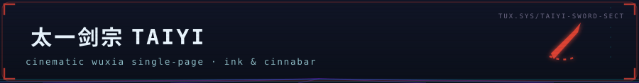

<div align="center">



**Cultivate the Dao.** A wuxia cultivators website — a cinematic single-page
experience where editorial paper aesthetics meet ink-brush fantasy, animated
with [anime.js v4](https://github.com/juliangarnier/anime).

[](https://www.typescriptlang.org/)
[](https://github.com/juliangarnier/anime)
[](https://github.com/ssmurfgg04-gif/taiyi-sword-sect/stargazers)
[](https://github.com/ssmurfgg04-gif/taiyi-sword-sect/commits/main)

</div>

## ⚔️ The Experience

| Section | What happens |
|---|---|
| **Ensō Preloader** | Brush circle stroke-draws around 问道 while a counter climbs; two-tone curtain wipe (paper → cinnabar) |
| **Hero — "THE BLADE IS THE DAO."** | Per-character stagger reveal, giant 剑道 brush watermark (breathing + parallax), spring-slammed seal stamp, hand-drawn annotations, mountain ridge line-draw, incense mote canvas |
| **Marquee** | The nine realms loop infinitely across a bordered strip |
| **Manifesto** | Words ignite from faint ink to full as you scroll (scrubbed via `onScroll` sync) |
| **Nine Gates 境界** | Sticky hanzi rail tracks your position; cinnabar progress line scrubs with scroll; each gate's SVG icon stroke-draws in view |
| **Four Scrolls 道法** | Hard-shadow paper cards with drawable duotone illustrations and difficulty seals |
| **Council of Elders 长老堂** | Ink-dark dossier cards, drawable medallion rings, hover tint-shift to seal red |
| **Scripture 典籍** | Night scroll — blurred character stagger reveal over rising embers |
| **The Gate 山门** | Crane-mail join form with toast confirmation |

Plus: ink-dot cursor follower, inertial smooth scrolling (lenis-style wheel
lerp), paper-grid + grain textures, custom scrollbar & selection, and full
`prefers-reduced-motion` fallbacks.

## 🧱 Stack

- **Next.js 16** (App Router) + **TypeScript**
- **Tailwind CSS 4** with a custom wuxia token system (paper / ink / cinnabar / jade / gold)
- **anime.js v4** — `animate`, `createTimeline`, `createScope`, `onScroll`, `svg.createDrawable`, `createSpring`, `stagger`, `utils`
- Fonts: Fraunces (display), Ma Shan Zheng (brush), Noto Serif SC (Chinese body), Space Mono (labels), DM Sans (body), Caveat (annotations)

## 🏃 Run

```bash
bun install
bun run dev
```

## 🎨 Design DNA

Learned from [illoca](https://illoca-kappa.vercel.app/) — paper-grid
backgrounds, oversized grotesque display type, hand-drawn annotations with
dotted underlines, floating pill nav, hard offset shadows, monospace
micro-labels — reinterpreted through a wuxia lens: rice-paper 宣纸, cinnabar
seals 朱砂, and ink 墨.

*<sub>Cultivation path: 炼气 → 筑基 → 金丹 → 元婴 → 化神 → 洞虚 → 合体 → 大乘 → 飞升</sub>*

---

<div align="center">

<sub>🐧 part of <a href="https://github.com/ssmurfgg04-gif">the ice shelf</a> · cold code, warm commits ❄️</sub>

</div>
